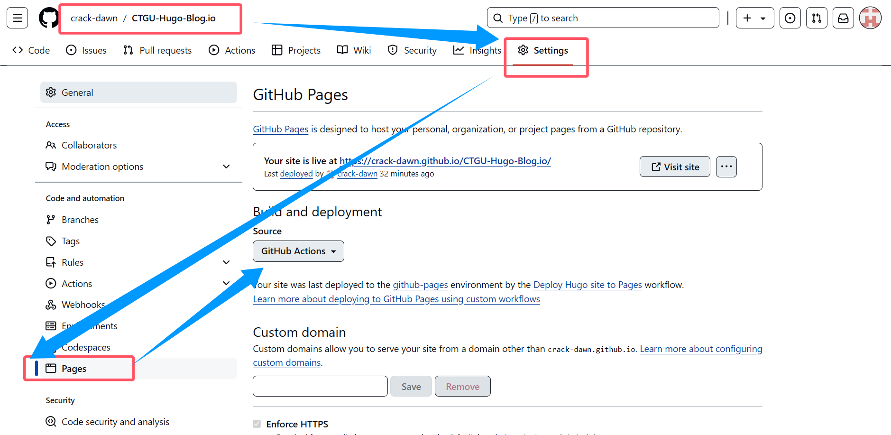

我尝试创建的模板hugo静态github pages：
https://crack-dawn.github.io/CTGU-Hugo-Blog.io/

所有设置参考：
https://fixit.lruihao.cn/zh-cn/documentation/getting-started/configuration/
 

## 1.如何快速创建hugo博客仓库/个人笔记
> 请看： [hugo quick start](https://gohugo.io/getting-started/quick-start/)
>

## 2.我的操作步骤
1. 新建一个hugo博客仓库
```
hugo new site quickstart
cd quickstart
git init
```

2. 我使用的主题是[FixIt](https://github.com/hugo-fixit/FixIt)
添加并配置自己的主题：
```
git submodule add https://github.com/hugo-fixit/FixIt.git ./themes/
echo "theme = 'FixIt'" >> hugo.toml
hugo server
```
> tips: 如果因为编码问题乱码，可以尝试：直接打开hugo.toml文件，编辑内容，添加一行`theme = 'FixIt'` 保存即可
基础样例添加主题后修改为：
```
baseURL = 'https://example.org/'
languageCode = 'en-us'
title = 'My New Hugo Site'
theme = 'FixIt'
```

3. 添加自己的markdown笔记
操作命令如下
```
hugo new content content/posts/my-first-post.md
```
Start Hugo’s development server to see your changes, remembering to include draft content.


4. 好了，接下来我们测试下hugo的博客网站
```
hugo server -D
```

5. 测试完成后，我们使用git提交到github上
```
git add .
git commit -m "first commit"
git add remote origin https://github.com/你的仓库地址.
git push -u origin master
```

## 3.部署到github pages
1. 添加gi



---
###  题外话
1. gitmodules 分布式构建项目，第一次接触

2. 尝试使用hugo快速搭建个人博客
3. 借鉴 [SHUFly溯源手册
](https://github.com/shuosc/fly?tab=readme-ov-file)
4. 慢慢了解hugo的功能框架，本身也是接触硬件多，网站运维知识并不了解；但是hugo的博客搭建，我感觉挺轻快有趣的。
5. 还没摸清楚 `github action` 和 `github pages`以及`workflow`的使用技巧。 


6. 建立好项目后，可以尝试修改设置文件,[FixIt主题设置说明](https://fixit.lruihao.cn/zh-cn/documentation/getting-started/configuration/)

<!-- hugo mod init github.com/crack-dawn/CTGU-Student-Hugo-Blog
git@github.com:crack-dawn/CTGU-Student-Hugo-Blog.git -->
